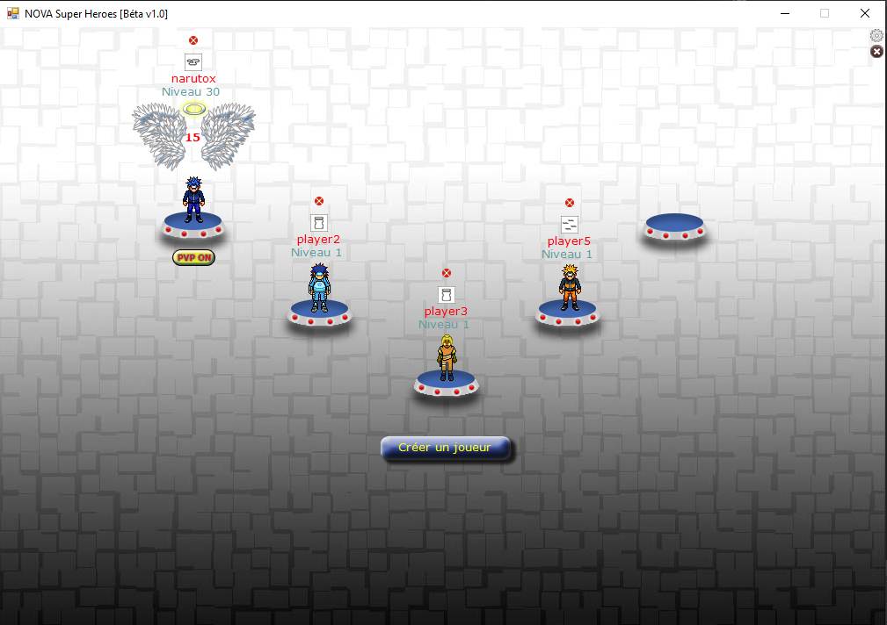

# Nova (Discontinued since 2017)

2d RPG Game

Nova is a prototype Rpg 2d game based on old version of my repo MELHARFI 2d Game engine (in the same repository)
This project was only a way to experimante my 2d game engine so the code is really horible so i appologies for the content.

Partie 1
https://www.youtube.com/watch?v=D6VQARWxfvs

Partie 2
https://www.youtube.com/watch?v=ufQObcknmVY

Partie 3
https://www.youtube.com/watch?v=BCrMBdIy9xk

I left the project as i said but you still can try if you can continue this project or start from scratch. cause there is a lot of issues and it was my first game coding try in fact, there's no known usage of POO, nor pattern, not reflection ...

I did not finish to convert from old way handling network message by enumerating each packet to a better way by reflection but job not finished, and therefore there is 2 ways still coexist of handling packets.

A lot of nomination issues, some english words, some frensh lol
Need a lot of refactoring.

Spell event handler not terminated i think.

Using old version of my 2d game engine because i tough there was not a Tag attached to the client so i just added mine (wast of time).

Limitation of MELHARFI 2d game engine (see repo for this)

This is only to keep traces of my works and for some who want to have a look ^^

Unfortunatly the battle was possible before but after some changes (refactorisation not finished) it's not possible to launche a battle ans give the spells some try :-(

There is a database inside "mmorpg.sql" must called mmorpg using mysql.
No install, just look in the bin/Debug both for server and client.

some accounts is already database
username : admin, admin2, admin3, admin4, morpher
same password : 123456

There is 4 projects in the solution.

MMORPG is the client.

Server.

MELHARFI an old version of my 2d game engine based en GDI+.

NovaEffect to handle spells effects.
